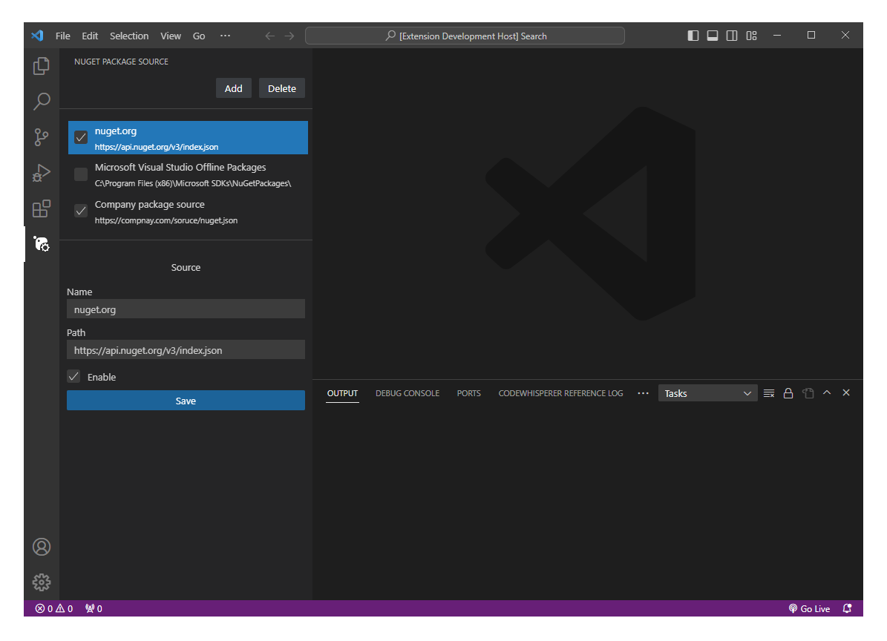

# Nuget Package Source

Visual Studio Code extension to manage Nuget Package Sources.

## Features

- 📃 Show all sources
- ➕ Add source
- ❌ Remove source
- ✏️ Update source
- ☑️ Enable source
- ⬛ Disable source

[Download](https://marketplace.visualstudio.com/items?itemName=9paradox.nuget-package-source) from Visual Studio Code marketplace.

## Contribution

Contributions are always welcome.

## License

[MIT](https://choosealicense.com/licenses/mit/)
